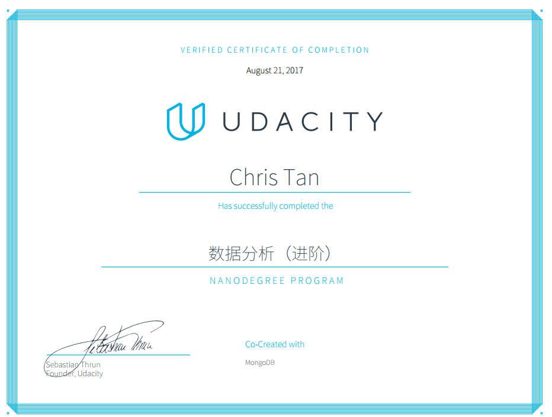

# udacity-dand(advanced)
Projects for my Udacity Data Analyst Nanodegree(advanced)

## Courses taken:
* Data Wrangling with MongoDB (p3)
* Data Analysis with R (p4)
* Intro to Machine Learning (p5)
* Data Visualization and D3.js (p6)

* Descriptive Statistics (Self-Study)
* Inferential Statistics (Self-Study)
* Intro to Data Analysis (Self-Study)
* Data Visualization in Tableau (Self-Study)
* A/B Testing (Self-Study)

## Skills acquired:
* Python (inc. numpy, pandas, scikit-learn, ggplot...)
* MongoDB
* SQL
* R (inc. dplyr, ggplot...)
* D3.js & dimple.js 

### P3: Wrangle OpenStreetMap Data

Choose any area of the world in https://www.openstreetmap.org and use data munging techniques, such as assessing the quality of the data for validity, accuracy, completeness, consistency and uniformity, to clean the OpenStreetMap data for a part of the world that you care about. Choose to learn SQL or MongoDB and apply your chosen schema to the project.

[Link to report](/p3)

### P4: Explore and Summarize Data

Use R and apply exploratory data analysis techniques to explore a selected data set for distributions, outliers, and anomalies.

[Link to report](/p4)

### P5: Identify Fraud from Enron Email

Play detective and put your machine learning skills to use by building an algorithm to identify Enron Employees who may have committed fraud based on the public Enron financial and email dataset.

[Link to report](/p5)

### P6: Make Effective Data Visualization
Create a data visualization from a data set that tells a story or highlights trends or patterns in the data. Use either dimple.js or d3.js to create the visualization. Your work should be a reflection of the theory and practice of data visualization, such as visual encodings, design principles, and effective communication.

[Link to report](/p6)

